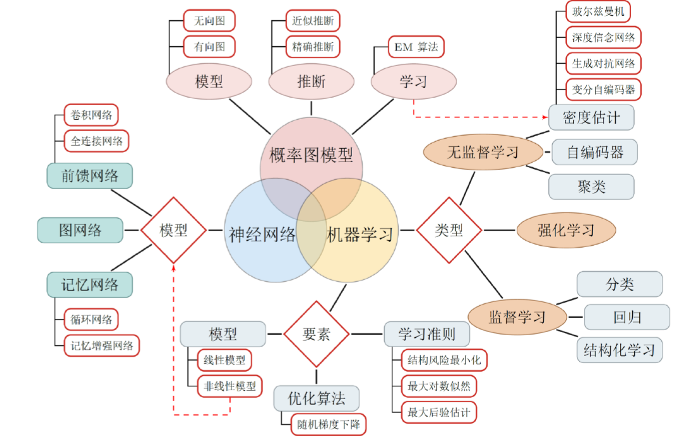

 

-------------------------------------------------

# 主要内容
- 核心内容：[神经网路与深度学习](https://nndl.github.io/)
- 参考资料：下方“推荐资料”
- 编程练习：[NNDL课程作业](https://github.com/nndl/exercise)，[李宏毅机器学习2019HW](http://speech.ee.ntu.edu.tw/~tlkagk/courses_ML19.html)

| 章节      |    补充资料 | 笔记  | 课后习题 | 编程练习|
| :-------- | :--------| :----- | :---- | :-- |
| **第一部分 入门篇**  | ||| | 
| 第1章 绪论  |  |     | | [chap1](https://github.com/SimpleLP/exercise_nndl/tree/master/chap1_warmup)| 
| 第2章 机器学习概述  |Hung-yi Lee: [Introduction2017](http://speech.ee.ntu.edu.tw/~tlkagk/courses_ML17_2.html), [Introduction2019](http://speech.ee.ntu.edu.tw/~tlkagk/courses_ML19.html), [Regression](http://speech.ee.ntu.edu.tw/~tlkagk/courses_ML17_2.html), [BiasAndVar](http://speech.ee.ntu.edu.tw/~tlkagk/courses_ML17_2.html), [Gradient Descent](http://speech.ee.ntu.edu.tw/~tlkagk/courses_ML17_2.html)  白板推导系列：[开篇](https://github.com/shuhuai007/Machine-Learning-Session), [线性回归](https://github.com/shuhuai007/Machine-Learning-Session)|[线性回归](LinearRegression/LinearRegression.pdf) | | 
| 第3章 线性模型  | Hung-yi Lee: [Probabilistic Generative Model](http://speech.ee.ntu.edu.tw/~tlkagk/courses_ML17_2.html), [Logistic Regression](http://speech.ee.ntu.edu.tw/~tlkagk/courses_ML17_2.html), [SVM](http://speech.ee.ntu.edu.tw/~tlkagk/courses_ML16.html) |     | | | 
| **第二部分 基础模型**  | ||| | 
| 第4章 前馈神经网络  | Hung-yi Lee: [ Introduction of Deep Learning](http://speech.ee.ntu.edu.tw/~tlkagk/courses_ML17_2.html), [Backpropagation](http://speech.ee.ntu.edu.tw/~tlkagk/courses_ML17_2.html), [Computational Graph](http://speech.ee.ntu.edu.tw/~tlkagk/courses_MLDS18.html), [“Hello world” of deep learning](http://speech.ee.ntu.edu.tw/~tlkagk/courses_ML17_2.html)|     | | | 
| 第5章 卷积神经网络  | Hung-yi Lee: [Convolutional Neural Network](http://speech.ee.ntu.edu.tw/~tlkagk/courses_ML17_2.html), [Why Deep](http://speech.ee.ntu.edu.tw/~tlkagk/courses_ML17_2.html), [Why Deep Structure?](http://speech.ee.ntu.edu.tw/~tlkagk/courses_MLDS18.html)  |     | | | 
| 第6章 循环神经网络  | Hung-yi Lee: [Recurrent Neural Network](http://speech.ee.ntu.edu.tw/~tlkagk/courses_ML17_2.html), [Recursive Network](http://speech.ee.ntu.edu.tw/~tlkagk/courses_MLDS18.html)  |     | | | 
| 第7章 网络优化与正则化   |Hung-yi Lee: [Tips for deep learning](http://speech.ee.ntu.edu.tw/~tlkagk/courses_ML17_2.html), [Optimization](http://speech.ee.ntu.edu.tw/~tlkagk/courses_MLDS18.html), [Special Training Technology](http://speech.ee.ntu.edu.tw/~tlkagk/courses_MLDS18.html)   |     | | | 
| 第8章 注意力机制与外部记忆  |Hung-yi Lee: [Attention-based Model](http://speech.ee.ntu.edu.tw/~tlkagk/courses_MLDS18.html), [Attention is all you need](https://arxiv.org/pdf/1706.03762.pdf)   |     | | | 
| 第9章 无监督学习  | Hung-yi Lee: [Unsupervised Learning](http://speech.ee.ntu.edu.tw/~tlkagk/courses_ML17_2.html), [More Auto-encoder ](http://speech.ee.ntu.edu.tw/~tlkagk/courses_ML19.html)  李航：《统计学习方法（第二版）》第二篇 Pang-Ning Tan：《数据挖掘导论》聚类分析 周志华：《机器学习》聚类、降维|     | | | 
| 第10章 模型独立的学习方法  | Hung-yi Lee: [Ensemble](http://speech.ee.ntu.edu.tw/~tlkagk/courses_ML17_2.html), [Semi-supervised Learning](http://speech.ee.ntu.edu.tw/~tlkagk/courses_ML17_2.html), [Transfer Learning](http://speech.ee.ntu.edu.tw/~tlkagk/courses_ML17_2.html), [Life-long learning](http://speech.ee.ntu.edu.tw/~tlkagk/courses_ML19.html), [Meta Learning](http://speech.ee.ntu.edu.tw/~tlkagk/courses_ML19.html), |     | | | 
| **第三部分 进阶模型**  | ||| | 
| 第11章 概率图模型  |Hung-yi Lee: [Graphical Model, Gibbs Sampling](http://speech.ee.ntu.edu.tw/~tlkagk/courses_MLSD15_2.html), [Markov Logic Network](http://speech.ee.ntu.edu.tw/~tlkagk/courses_MLSD15_2.html), [Structured Learning](http://speech.ee.ntu.edu.tw/~tlkagk/courses_ML16.html), [SVM^struct](http://speech.ee.ntu.edu.tw/~tlkagk/courses_MLSD15_2.html), [Learning with Hidden Information](http://speech.ee.ntu.edu.tw/~tlkagk/courses_MLSD15_2.html)  |     | | | 
| 第12章 深度信念网络  |Hung-yi Lee:    |     | | | 
| 第13章 深度生成模型  |Hung-yi Lee: [Deep Generative Model](http://speech.ee.ntu.edu.tw/~tlkagk/courses_ML17_2.html), [Generative Adversarial Network](http://speech.ee.ntu.edu.tw/~tlkagk/courses_MLDS18.html)   |     | | | 
| 第14章 深度强化学习  |Hung-yi Lee: [Deep Reinforcement Learning](http://speech.ee.ntu.edu.tw/~tlkagk/courses_ML17_2.html), [Deep Reinforcement Learning2](http://speech.ee.ntu.edu.tw/~tlkagk/courses_MLDS18.html)   |     | | | 
| 第15章 序列生成模型  |Hung-yi Lee: [Word Embedding](http://speech.ee.ntu.edu.tw/~tlkagk/courses_ML17_2.html), [Sequence-to-sequence and Attention](http://speech.ee.ntu.edu.tw/~tlkagk/courses_ML17_2.html), [Transformer](http://speech.ee.ntu.edu.tw/~tlkagk/courses_ML19.html), [BERT](http://speech.ee.ntu.edu.tw/~tlkagk/courses_ML19.html), [Seq-to-seq Learning by CNN](https://arxiv.org/pdf/1705.03122.pdf) |     | | | 
| **附录**  | ||| | 
| 附录A 线性代数  |  |     | | | 
| 附录B 微积分  |  |     | | | 
| 附录C 数学优化  |   |     | | | 
| 附录D 概率论  |   |     | | | 
| 附录E 信息论  |   |     | | | 

补充：
- [Anomaly Detection](http://speech.ee.ntu.edu.tw/~tlkagk/courses_ML19.html)
- [Adversarial Attack](http://speech.ee.ntu.edu.tw/~tlkagk/courses_ML19.html)
- [Explainable ML](http://speech.ee.ntu.edu.tw/~tlkagk/courses_ML19.html)
- [Network Compression](http://speech.ee.ntu.edu.tw/~tlkagk/courses_ML19.html)
- [Pointer Network](http://speech.ee.ntu.edu.tw/~tlkagk/courses_MLDS18.html)
- [Matrix Factorization](http://speech.ee.ntu.edu.tw/~tlkagk/courses_ML17.html)
- [Spatial Transformer Layer](http://speech.ee.ntu.edu.tw/~tlkagk/courses_MLDS17.html)
- [Highway Network & Grid LSTM](http://speech.ee.ntu.edu.tw/~tlkagk/courses_MLDS17.html)
- [Generalization](http://speech.ee.ntu.edu.tw/~tlkagk/courses_MLDS18.html)

**更新日志**
- 建立网页，2019/8/24
- 

--------------------------------------------------

# 推荐资料

**入门**
- [Google: Machine Learning Crash Course](https://developers.google.com/machine-learning/crash-course/)
- [Neural Networks and Deep Learning, Michael Nielsen](http://neuralnetworksanddeeplearning.com/)

**基础**
- 《机器学习》， 周志华著；《统计学习方法（第二版）》，李航著 &emsp;[[知乎参考读物](https://zhuanlan.zhihu.com/p/36378498)]  
  - [机器学习](http://58.198.176.86/qwdong/machinelearning/)，董启文老师讲授 
- 《模式识别与机器学习》， 马春鹏译
  - PRML相关Slides： [FUDAN PRML](https://zfhu.ac.cn/PRML-Spring19-Fudan/)&emsp;[DaSE PRML](https://github.com/ECNUdase/Seminar-PRML)
  - [机器学习, 白板推导系列](https://github.com/shuhuai007/Machine-Learning-Session)&emsp;[Note](https://github.com/ws13685555932/machine_learning_derivation) 
- [神经网络与深度学习](https://nndl.github.io/) ，邱锡鹏著
    - [机器学习](http://speech.ee.ntu.edu.tw/~tlkagk/courses_ML17_2.html)， 李宏毅 
- 《深度学习》，Lan Goodfellow等著
    - [李宏毅MLDS](http://speech.ee.ntu.edu.tw/~tlkagk/courses_MLDS18.html)
    - [CMU Introduction to Deep Learning](http://deeplearning.cs.cmu.edu/)
- 《概率图模型：原理与技术》Daphne Koller著
    - [CMU 10-708: Probabilistic Graphical Models](https://sailinglab.github.io/pgm-spring-2019/)
    - [Stanford CS228: Probabilistic Graphical Model](https://cs228.stanford.edu/)
    
**进阶**
- [NN4ML](https://www.bilibili.com/video/av9838961?from=search&seid=12389028944234946948),Hinton
- [Stat212b: Topics Course on Deep Learning](http://joanbruna.github.io/stat212b/), Joan Bruna(Yann LeCun博士后)
- [NYU: MACHINE LEARNING](https://davidrosenberg.github.io/ml2019/#resources?utm_source=wechat_session&utm_medium=social&utm_oi=844207196790202368&nsukey=rb5HTvIlGMlnGJ1rCFoqoQomgMOhQe0J00cRZsoLPJxGfWlAVSCxkFUqVHPdpGpSdkcnAH8y9ApeFvaNGir2znHWUe61CH4RyX79R8oqq8CmqWiL3ZbZfuDvSScXl7C8zcXlGVaErk1kRQewyHY8j%2Bee3yq1zuoQ8GagBtKnKdw%3D)
- [Materials for Deep Learning](https://github.com/nndl/materials-for-deep-learning), FDUNLP

**实战**
- [慕课网：Python3玩转机器学习](https://coding.imooc.com/class/169.html)
- [邹博机器学习](https://www.bilibili.com/video/av23585080?from=search&seid=162992797617774420)
- [邹博深度学习](https://www.bilibili.com/video/av50327129?from=search&seid=1080630462980792268)

**附加资料**
- [Interpretable Machine Learning](https://christophm.github.io/interpretable-ml-book/index.html)
- [AI算法工程师笔记](http://www.huaxiaozhuan.com/)
- [CS229](http://cs229.stanford.edu/syllabus.html)，主要看NOTES与最新论文
- 机器学习（Coursera版本主要关注大规模机器学习；斯坦福版本主要关注理论推导），吴恩达
- 深度学习（Coursera版本；CS230），吴恩达
- 机器学习基础、机器学习技法，林轩田
- [36-708 Statistical Methods for Machine Learning](http://www.stat.cmu.edu/~larry/=sml/)
- CMU 10-715 Advanced Introduction to Machine Learning
- 《Machine Learning：A Probabilistic Perspective》 
- 《[An Introduction to Statistical Learning](http://www-bcf.usc.edu/~gareth/ISL/)》
  - [Stanford Lagunita: Statistical Learning](https://lagunita.stanford.edu/courses/HumanitiesSciences/StatLearning/Winter2016/about)
  - [UCB: Introduction to Machine Learning](https://people.eecs.berkeley.edu/~jrs/189/)
- 《The Elements of Statistical Learning》
- 统计机器学习，机器学习导论，张志华
- 机器学习，徐亦达

------------------------------------------------------------

This page maintained by @ <a href="https://simplelp.github.io/">SimplePeng</a>, 	
<a href="https://github.com/SimpleLP/Machine-Learning/">View on GitHub</a>

